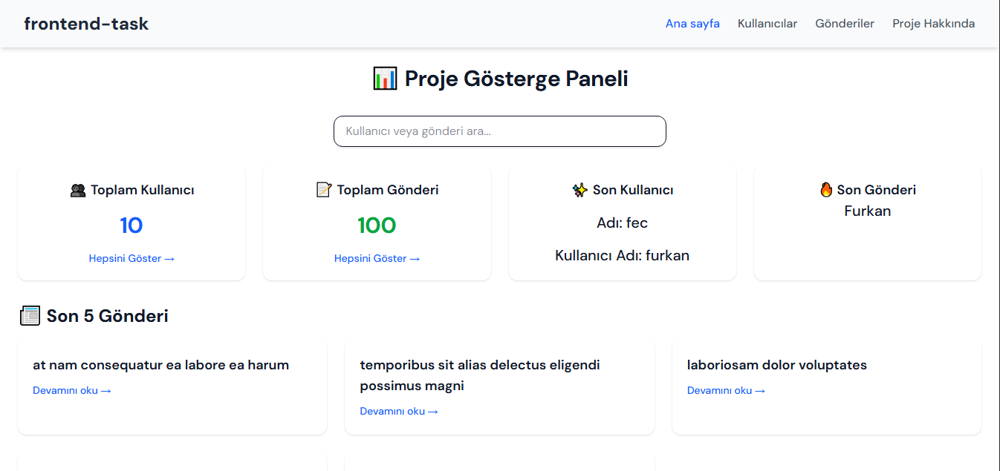

# 📊 React + Vite + TypeScript CRUD Gösterge Paneli

Bu proje, [JSONPlaceholder](https://jsonplaceholder.typicode.com/) API'si kullanılarak kullanıcı ve gönderi işlemlerini gerçekleştiren modern bir **CRUD (Create, Read, Update, Delete)** uygulamasıdır. Uygulama, kullanıcı dostu bir gösterge paneli sunar ve modern frontend teknolojileri ile geliştirilmiştir.

## 🌐 Canlı Demo

🔗 Projeyi canlı olarak deneyimlemek için aşağıdaki bağlantıya tıklayabilirsiniz:

👉 **[Canlı Demo](https://furkancetintas-frontendtask.netlify.app/)**

---

## 👨‍💻 Geliştirici

**Furkan Enes Çetintaş**  
🔗 [Kişisel Web Sitesi](https://furkancetintas.netlify.app/)  
🔗 [GitHub Profilim](https://github.com/furkancetintas)

## 🖼️ Uygulamanın Ana Sayfa Ekranı


## 🚀 Özellikler

- ✅ **Kullanıcı İşlemleri**
  - Kullanıcıları listeleme
  - Yeni kullanıcı ekleme
  - Kullanıcı güncelleme
  - Kullanıcı silme

- ✅ **Gönderi (Post) İşlemleri**
  - Gönderileri listeleme
  - Yeni gönderi ekleme
  - Gönderi güncelleme
  - Gönderi silme

- 🔍 Gerçek zamanlı kullanıcı ve gönderi araması
- 📊 Gösterge panelinde kullanıcı ve gönderi sayıları
- 🔔 Bildirim sistemi (Sonner)
- 🌈 Animasyonlarla zenginleştirilmiş kullanıcı deneyimi (Framer Motion)
- 📱 Responsive tasarım (TailwindCSS)

## 🛠️ Kullanılan Teknolojiler

| Teknoloji        | Açıklama |
|------------------|----------|
| **React**        | UI oluşturmak için JS kütüphanesi |
| **Vite**         | Hızlı geliştirme ortamı |
| **TypeScript**   | Güvenli, tip destekli JavaScript |
| **TailwindCSS**  | Utility-first CSS framework |
| **React Router** | Sayfalar arası geçiş (routing) |
| **Sonner**       | Kullanıcıya toast bildirimleri sunar |
| **Framer Motion**| Animasyonlar ve geçiş efektleri |
| **Lucide React** | Modern ve şık ikon kütüphanesi |

## 🧾 Sayfa Yapısı

Proje aşağıdaki sayfalardan oluşur:

| Sayfa         | Açıklama |
|---------------|----------|
| 🏠 **Ana Sayfa**       | Kullanıcı & Gönderi istatistikleri, son 5 gönderi, son 3 kullanıcı ve kullanıcı ya da gönderi arama özelliği |
| 👥 **Kullanıcılar**    | Tüm kullanıcıları listeleme, silme, güncelleme, ekleme |
| 📝 **Gönderiler**      | Tüm gönderileri listeleme, silme, güncelleme, ekleme |
| ℹ️ **Proje Hakkında** | Projenin kısa açıklaması ve özellikler sayfası ve kullanılan teknolojilerin bilgisi |

## 📁 Proje Yapısı

## 📁 Proje Yapısı

```bash

src/
├── assets/             # Görseller ve medya dosyaları
├── components/         # Ortak (reusable) bileşenler
│   ├── Footer/         # Alt bilgi bileşeni
│   ├── Navbar/         # Navigasyon menüsü
│   ├── PostForm/       # Gönderi oluşturma/güncelleme formu
│   └── UserForm/       # Kullanıcı oluşturma/güncelleme formu
├── pages/              # Sayfa bileşenleri
│   ├── About/          # Proje hakkında sayfası
│   ├── Homepage/       # Gösterge paneli / ana sayfa
│   ├── Posts/          # Gönderi listeleme ve yönetim sayfası
│   └── Users/          # Kullanıcı listeleme ve yönetim sayfası
├── services/           # API işlemleri ve dış veri bağlantıları
│   └── api.ts          # JSONPlaceholder API entegrasyonu
├── App.tsx             # Ana uygulama bileşeni ve rotalar
└── App.css             # Global CSS (Tailwind base stilleri)


---

## ⚙️ Kurulum ve Çalıştırma

Projeyi kendi bilgisayarınızda çalıştırmak için:

```bash
# 1. Depoyu klonlayın
git clone https://github.com/furkancetintas/frontend-task.git

# 2. Proje klasörüne girin
cd frontend-task

# 3. Gerekli paketleri yükleyin
npm install

# 4. Uygulamayı başlatın
npm run dev
